[](https://classroom.github.com/a/XoLGRbHq)
[](https://classroom.github.com/online_ide?assignment_repo_id=15288764&assignment_repo_type=AssignmentRepo)
# SE-Assignment-5
Installation and Navigation of Visual Studio Code (VS Code)
 Instructions:
Answer the following questions based on your understanding of the installation and navigation of Visual Studio Code (VS Code). Provide detailed explanations and examples where appropriate.

 Questions:

1. Installation of VS Code:
   - Describe the steps to download and install Visual Studio Code on Windows 11 operating system. Include any prerequisites that might be needed.
   To download and install Visual Studio Code (VS Code) on Windows 11, follow these steps:

### Prerequisites:
1. **Internet Connection**: Ensure you have an active internet connection to download the installer.
2. **Administrator Privileges**: You may need administrative privileges on your Windows 11 machine to install software.

### Steps to Download and Install Visual Studio Code:

1. **Download VS Code Installer:**
   - Open a web browser and go to the official Visual Studio Code website: [https://code.visualstudio.com/](https://code.visualstudio.com/)
   - Click on the "Download for Windows" button. This will download the VS Code installer file (`VSCodeSetup.exe`).

2. **Run the Installer:**
   - Once the download completes, locate the downloaded `VSCodeSetup.exe` file, usually in your Downloads folder.
   - Double-click on the `VSCodeSetup.exe` file to run it. If prompted by User Account Control (UAC), click "Yes" to allow the installer to make changes to your device.

3. **Install Visual Studio Code:**
   - The VS Code Setup wizard will open. Click on "Next" to proceed.
   - Review the License Agreement, and if you agree, select "I accept the agreement" and click "Next".
   - Choose the destination folder where you want to install Visual Studio Code or leave the default setting, then click "Next".
   - Optionally, you can choose additional tasks such as creating a desktop icon or adding VS Code to the PATH for easier command-line access. Once chosen, click "Next".

4. **Complete the Installation:**
   - Click on "Install" to begin the installation process. The installer will now download and install Visual Studio Code on your Windows 11 system.
   - Once the installation is complete, click on "Finish" to exit the installer.

5. **Launch Visual Studio Code:**
   - After installation, you can launch Visual Studio Code from the desktop shortcut (if created) or by searching for "Visual Studio Code" in the Start menu.

6. **Update VS Code (Optional but Recommended):**
   - After launching VS Code, periodically check for updates by clicking on the gear icon (Settings) in the lower left corner, then selecting "Check for Updates". This ensures you have the latest features and security patches.

### Additional Tips:
- **Extensions**: VS Code supports extensions for additional features and languages. Explore and install extensions that enhance your development environment.
- **Settings Sync**: Consider using the built-in Settings Sync feature to sync your VS Code settings across different machines.

By following these steps, you should successfully download and install Visual Studio Code on your Windows 11 operating system.

2. First-time Setup:
   - After installing VS Code, what initial configurations and settings should be adjusted for an optimal coding environment? Mention any important settings or extensions.
   1. Install Essential Extensions:
a. Language Support:

Open VS Code.
Click on the Extensions icon in the Activity Bar on the side (or press Ctrl+Shift+X).
Search for the language extension you need (e.g., Python, JavaScript) and click "Install".
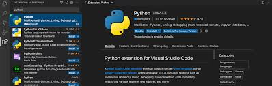

b. Git Integration (GitLens):

Install the "GitLens" extension for advanced Git integration.
Search for "GitLens" in the Extensions view and click "Install".


c. Debugger (Example: Debugger for Chrome):

Install a debugger extension like "Debugger for Chrome" if needed.
Search for "Debugger for Chrome" in the Extensions view and click "Install".
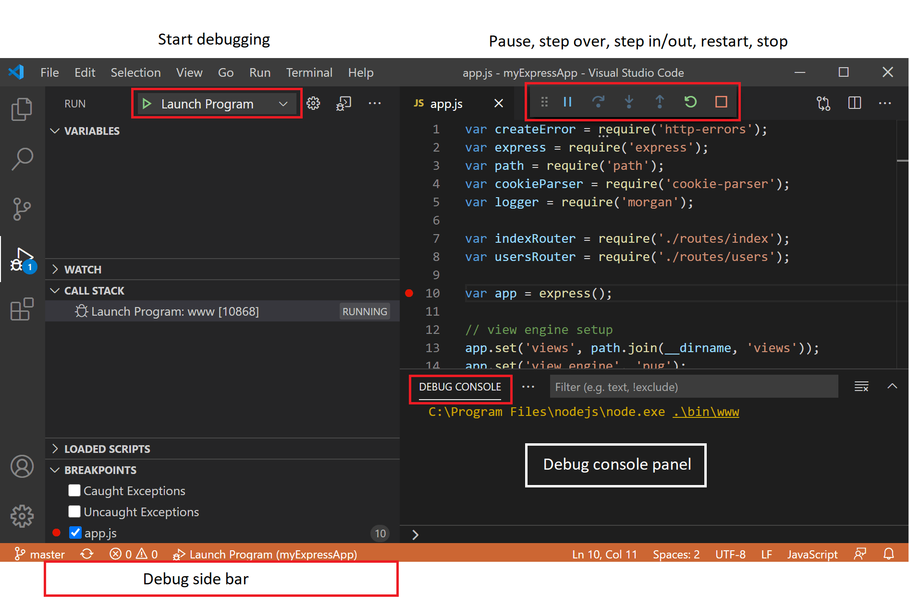


2. Adjust Visual Studio Code Settings:
a. Open Settings:

Click on the gear icon (Settings) in the lower left corner or press Ctrl+,.
b. Example Settings to Adjust:

Set Font and Theme (editor.fontFamily, workbench.colorTheme).
Configure Tab Size and Indentation (editor.tabSize, editor.insertSpaces).
Enable Line Numbers (editor.lineNumbers).
Configure Auto Save (files.autoSave).
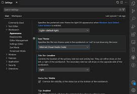

3. Configure Git Integration:
a. Verify Git Installation:

Open a terminal in VS Code (Ctrl+``) and type git --version` to verify Git is installed.
b. Configure Git Identity:

Set your Git username and email globally using Git commands (git config --global user.name "Your Name" and git config --global user.email "your.email@example.com").
4. Workspace Setup:
a. Open Project Folder:

Click on "File" > "Open Folder..." and select your project folder.
b. Save Workspace:

Save the workspace (File > Save Workspace As...) to retain settings and open files.
5. Explore Command Palette:
a. Open Command Palette:

Press Ctrl+Shift+P to open the Command Palette.
Use it to execute tasks, search for settings, install extensions, etc.
6. Learn Keyboard Shortcuts:
a. Use Keyboard Shortcuts:

Familiarize yourself with common shortcuts (Ctrl+S for save, Ctrl+F for search, etc.)


3.User Interface Overview:

  - Explain the main components of the VS Code user interface. Identify and describe the purpose of the Activity Bar, Side Bar, Editor Group, and Status Bar.
  Sure! Let's go through the main components of the Visual Studio Code (VS Code) user interface:

### 1. Activity Bar:

The Activity Bar is located on the far left side of the VS Code window. It provides quick access to different views and functionalities of the editor.

- **File Explorer Icon**: Allows navigation and management of files and folders in your project.
- **Search Icon**: Enables searching across files and folders within the workspace.
- **Source Control Icon**: Integrates with version control systems like Git for managing changes.
- **Run and Debug Icon**: Provides options for running and debugging your code.
- **Extensions Icon**: Manages VS Code extensions and marketplace.

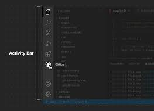

### 2. Side Bar:

The Side Bar is located next to the Activity Bar and contains various panels that provide additional functionality and information.

- **File Explorer**: Displays the files and folders in your project directory.
- **Search**: Allows searching within files across the project.
- **Source Control**: Integrates with Git, showing changes and allowing commit operations.
- **Extensions**: Manages VS Code extensions and marketplace.
- **Debug**: Provides debugging tools and information when debugging is active.
- **Remote Explorer (optional)**: If using remote development extensions, this panel appears for managing remote connections.

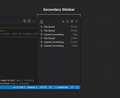

### 3. Editor Group:

The Editor Group is the main area where you work on your code or files. It occupies the central part of the VS Code window.

- **Editor Tabs**: Each open file or editor instance appears as a tab within the Editor Group.
- **Split Editors**: Allows splitting the Editor Group horizontally or vertically to view multiple files simultaneously.

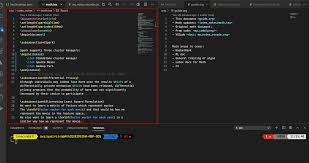

### 4. Status Bar:

The Status Bar is located at the bottom of the VS Code window and provides information and controls related to the current workspace and activities.

- **Language Mode**: Displays the programming language mode of the current file.
- **Line and Column Number**: Shows the current cursor position within the file.
- **Git Branch**: Shows the current Git branch and status if Git is initialized.
- **Notifications and Extensions**: Displays notifications about tasks, errors, and extension recommendation

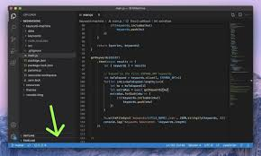

### Additional Tips:

- **Customization**: You can customize the appearance and behavior of VS Code by adjusting settings (`Ctrl+,`) and installing extensions.
- **Command Palette**: Access the Command Palette (`Ctrl+Shift+P`) for executing commands, searching for settings, and more.
- **Keyboard Shortcuts**: Learn and utilize keyboard shortcuts for faster navigation and productivity (`Ctrl+S` for save, `Ctrl+F` for search, etc.).

Understanding these main components will help you navigate and utilize Visual Studio Code efficiently for coding and development tasks on Windows 11.

4. Command Palette:
   - What is the Command Palette in VS Code, and how can it be accessed? Provide examples of common tasks that can be performed using the Command Palette.


### Accessing the Command Palette:

1. **Keyboard Shortcut Method:**
   - Press `Ctrl + Shift + P` (Windows/Linux) or `Cmd + Shift + P` (macOS).
   - This will open the Command Palette at the top center of the editor.

2. **Menu Method:**
   - Click on `View` in the menu bar at the top of VS Code.
   - From the dropdown menu, select `Command Palette...`.
   - This will also open the Command Palette at the top center of the editor.

### Examples of Common Tasks:

1. **Opening Files:**
   - After opening the Command Palette, type "File: Open File" and press Enter.
   - A file explorer will open, allowing you to select the file you want to open.

2. **Running Commands:**
   - In the Command Palette, type "Tasks: Run Build Task" and press Enter to run a build task.
   - Type "Debug: Start Debugging" and press Enter to start debugging your code.

3. **Changing Settings:**
   - Type "Preferences: Open Settings" and press Enter to open the settings JSON file.
   - Type "Preferences: Open Settings (UI)" and press Enter to open the graphical interface for settings.

4. **Searching and Installing Extensions:**
   - Type "Extensions: Install Extensions" and press Enter to search for and install new extensions from the marketplace.

5. **Version Control:**
   - Type "Git: Commit" and press Enter to commit changes to your Git repository.
   - Type "Git: Pull" or "Git: Push" and press Enter to perform pull or push operations.

6. **Formatting:**
   - Type "Format Document With..." and press Enter to access formatting options such as Prettier.

7. **Terminal:**
   - Type "Terminal: Create New Integrated Terminal" and press Enter to open a new integrated terminal within VS Code.

8. **Tasks and Debugging:**
   - Type "Tasks: Configure Task" and press Enter to configure tasks for your project.
   - Type "Debug: Open Configurations" and press Enter to manage debug configurations.

### Advantages of Using the Command Palette:

- **Speed:** Quickly access functionalities without navigating through menus.
- **Discoverability:** Easily discover and execute commands by typing keywords.
- **Customization:** Access additional functionalities and extensions directly from the Command Palette.

5. Extensions in VS Code:
   - Discuss the role of extensions in VS Code. How can users find, install, and manage extensions? Provide examples of essential extensions for web development.
### Role of Extensions in VS Code:

Extensions in Visual Studio Code (VS Code) enhance its functionality by adding new features, language support, themes, and integrations with external tools. They allow users to customize and extend the editor according to their specific needs, making VS Code a versatile and powerful environment for various development workflows.

### Finding, Installing, and Managing Extensions:

#### Finding Extensions:

1. **Using the Extensions View:**
   - Click on the Extensions icon in the Activity Bar on the side of VS Code (it looks like four squares connected together).
   - In the search bar at the top of the Extensions view, you can search for extensions by name, functionality, or category.

2. **VS Code Marketplace:**
   - Go to the [VS Code Marketplace](https://marketplace.visualstudio.com/vscode) website.
   - Search for extensions, read descriptions, reviews, and install directly to your VS Code instance.

#### Installing Extensions:

- Once you find an extension you want to install, click the `Install` button next to it in the Extensions view or on the marketplace website.
- VS Code will download and install the extension automatically.

#### Managing Extensions:

- **Disabling or Removing Extensions:**
  - In the Extensions view (`Ctrl + Shift + X` or `Cmd + Shift + X`), you can disable or remove extensions by clicking on the gear icon next to the extension.

- **Updating Extensions:**
  - Extensions that have updates available will show an `Update` button in the Extensions view. Click it to update the extension to the latest version.

### Examples of Essential Extensions for Web Development:

1. **ESLint:**
   - **Role:** Provides JavaScript linting (error checking) based on ESLint.
   - **Usage:** Helps maintain code quality and consistency in JavaScript projects.
   - 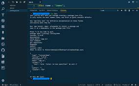

2. **Prettier - Code formatter:**
   - **Role:** Automatically formats code according to defined rules.
   - **Usage:** Ensures consistent code formatting across your project.
   - 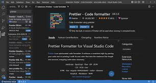

3. **Live Server:**
   - **Role:** Launches a development server with live reload capability.
   - **Usage:** Facilitates rapid web development by automatically refreshing the browser when files are saved.
   

4. **Debugger for Chrome:**
   - **Role:** Allows debugging of JavaScript code in the Chrome browser directly from VS Code.
   - **Usage:** Essential for debugging frontend JavaScript applications.
   

5. **GitLens - Git supercharged:**
   - **Role:** Enhances Git integration with features like blame information, repository history, and more.
   - **Usage:** Improves productivity and understanding of project history when working with Git.
   

### Advantages of Using Extensions in VS Code:

- **Customization:** Tailor VS Code to fit specific development needs.
- **Productivity:** Enhance workflow efficiency with specialized tools and integrations.
- **Community Support:** Benefit from a vibrant ecosystem of extensions contributed by developers worldwide.

Using these extensions, among many others available in the marketplace, significantly enhances the capabilities of Visual Studio Code for web development and various other programming tasks.

6. Integrated Terminal:

  - Describe how to open and use the integrated terminal in VS Code. What are the advantages of using the integrated terminal compared to an external terminal?

### Opening and Using the Integrated Terminal in VS Code:

#### Opening the Integrated Terminal:

1. **Using the Menu:**
   - Click on `Terminal` in the menu bar at the top of VS Code.
   - Select `New Terminal`.

2. **Using a Keyboard Shortcut:**
   - Press `Ctrl + ` (Backtick key, usually located under the Esc key on most keyboards).
   - This shortcut opens a new integrated terminal at the bottom of the VS Code window.

#### Using the Integrated Terminal:

- **Basic Commands:**
  - Once the terminal is open, you can use it just like any other terminal.
  - Navigate directories (`cd`), list files (`ls` or `dir`), run commands, etc.

- **Integrated Shell Selection:**
  - By default, VS Code uses the system's default shell (like Bash on Linux/macOS or PowerShell on Windows).
  - You can change the default shell or switch to a different shell by clicking on the dropdown arrow next to the terminal name and selecting from the list of available shells.

- **Terminal Tabs:**
  - You can have multiple terminal tabs open simultaneously by clicking on the `+` button next to the terminal tabs or using the shortcut `Ctrl + Shift + ` (Backtick key).

- **Terminal Settings:**
  - Customize terminal appearance and behavior via VS Code settings (e.g., font size, cursor style) accessible through `Settings > Features > Terminal`.

### Advantages of Using the Integrated Terminal:

1. **Seamless Integration:**
   - The terminal is directly integrated into VS Code, allowing you to switch between coding and running commands without switching applications.

2. **Contextual Awareness:**
   - The terminal automatically opens to the workspace directory, making it easier to run commands related to your project.

3. **Direct Access to VS Code Features:**
   - You can run VS Code commands (e.g., `git` commands through Git integration) directly from the terminal.

4. **Workspace Persistence:**
   - Terminal sessions persist across VS Code sessions, so you don't lose your terminal history or state when closing and reopening VS Code.

5. **Customization and Extension:**
   - Customize the terminal appearance and behavior using VS Code extensions and settings to suit your workflow.

6. **Productivity:**
   - Reduces context switching and improves overall development workflow efficiency by keeping everything within one interface.

### Comparison with External Terminals:

- **Convenience:** Eliminates the need to switch between VS Code and an external terminal window.
- **Efficiency:** Faster access to commands and outputs directly within the editor environment.
- **Integration:** Seamless interaction with VS Code features like Git and debugging.
- **Customization:** Tailor terminal settings and appearance directly through VS Code's interface.

7. File and Folder Management:
   - Explain how to create, open, and manage files and folders in VS Code. How can users navigate between different files and directories efficiently?
Certainly! Here's a guide to file and folder management in Visual Studio Code (VS Code) with textual descriptions and where images would be helpful:

### Creating Files and Folders:

1. **Creating a New File:**
   - Click on `File` in the menu bar at the top of VS Code.
   - Select `New File` to create a new file.
   - Alternatively, use the keyboard shortcut `Ctrl + N` (Windows/Linux) or `Cmd + N` (macOS).
   - 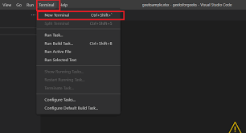

2. **Creating a New Folder:**
   - Click on `File` in the menu bar at the top of VS Code.
   - Select `New Folder` to create a new folder.
   - Alternatively, use the keyboard shortcut `Ctrl + Shift + N` (Windows/Linux) or `Cmd + Shift + N` (macOS).
   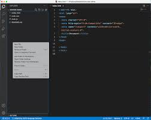

### Opening Files and Folders:

1. **Opening Files:**
   - Click on `File` in the menu bar at the top of VS Code.
   - Select `Open File...` to navigate to and open a specific file.
   - Use the keyboard shortcut `Ctrl + O` (Windows/Linux) or `Cmd + O` (macOS) to quickly open a file.
   

2. **Opening Folders:**
   - Click on `File` in the menu bar at the top of VS Code.
   - Select `Open Folder...` to open an entire folder as a workspace in VS Code.
   - Alternatively, drag and drop a folder into the VS Code window to open it.
   

### Managing Files and Folders:

1. **Renaming Files and Folders:**
   - Right-click on a file or folder in the Explorer sidebar.
   - Select `Rename` from the context menu and enter the new name.


2. **Deleting Files and Folders:**
   - Right-click on a file or folder in the Explorer sidebar.
   - Select `Delete` from the context menu to move it to the system's trash/recycle bin.
   

3. **Moving Files and Folders:**
   - Drag and drop files or folders within the Explorer sidebar to rearrange or move them.
   - You can also use the `Cut` and `Paste` options from the context menu to move files/folders.


### Navigating Between Files and Directories Efficiently:

1. **Using the Explorer Sidebar:**
   - The Explorer sidebar in VS Code lists all files and folders in the current workspace.
   - Click on a file to open it, or expand folders to navigate deeper into the directory structure.
   

2. **Switching Between Open Files:**
   - Use `Ctrl + Tab` (Windows/Linux) or `Cmd + Tab` (macOS) to cycle through open files in VS Code.
   - You can also use the `View > Open Editors` menu to see a list of all currently open files and quickly switch between them.

3. **Using Go to File (Quick Open):**
   - Press `Ctrl + P` (Windows/Linux) or `Cmd + P` (macOS) to open the Quick Open dialog.
   - Start typing the name of the file you want to open. VS Code will provide suggestions based on the filenames in your workspace.

### Efficiency Tips:

- **Keyboard Shortcuts:** Learn and use VS Code's keyboard shortcuts for file and folder operations to speed up your workflow.
- **Search and Replace:** Utilize VS Code's powerful search and replace functionality (`Ctrl + F` / `Cmd + F` for find, `Ctrl + H` / `Cmd + Option + F` for replace).
- **Workspace Management:** Use workspaces (`File > Save Workspace As...`) to manage related files and folders together for different projects.

8. Settings and Preferences:
   - Where can users find and customize settings in VS Code? Provide examples of how to change the theme, font size, and keybindings.
### Settings and Preferences in VS Code:

In Visual Studio Code (VS Code), users can customize a wide range of settings and preferences to tailor their development environment according to their preferences and workflow. Here’s how you can find and customize settings, along with examples of common customizations:

### Accessing Settings:

1. **Using the Settings UI:**
   - Click on the gear icon (`⚙️`) in the bottom left corner of the Activity Bar to open the Settings view.
   - Alternatively, press `Ctrl + ,` (Windows/Linux) or `Cmd + ,` (macOS) to open the Settings view directly.

2. **Editing JSON Settings:**
   - Click on the `Open Settings (JSON)` link in the top right corner of the Settings view to edit settings directly in JSON format.

### Examples of Customizations:

#### Changing the Theme:

1. **Using the Settings UI:**
   - In the Settings view, type "Color Theme" in the search box.
   - Click on the dropdown menu under "Color Theme" to select from installed themes.
   - Click on "Install Additional Color Themes" to browse and install new themes from the marketplace.

#### Adjusting Font Size:

1. **Using the Settings UI:**
   - In the Settings view, type "Font Size" in the search box.
   - Adjust the "Editor: Font Size" setting to your preferred size.
   - You can also adjust the font family and line height if needed.


#### Customizing Keybindings:

1. **Using the Keyboard Shortcuts UI:**
   - Click on the gear icon (`⚙️`) in the bottom left corner of the Activity Bar to open the Keyboard Shortcuts view.
   - Search for the specific command or keybinding you want to customize.
   - Click on the pencil icon next to the keybinding to edit it or add a new keybinding by clicking on the `+` icon.


### Additional Tips:

- **Settings Sync:** Use the built-in Settings Sync feature in VS Code to synchronize your settings, extensions, and keybindings across multiple instances of VS Code.
- **Extensions:** Some extensions may introduce additional settings or preferences related to their functionality. Explore the extensions marketplace for more customization options.

By utilizing these settings and customization options in VS Code, users can create a personalized development environment that enhances productivity and aligns with their coding preferences and habits.
9. ### Debugging in VS Code:

Debugging in Visual Studio Code (VS Code) is a powerful feature that allows developers to efficiently identify and fix issues in their code. Here’s a step-by-step outline on how to set up and start debugging a simple program:

### Setting Up and Starting Debugging:

1. **Install Required Extensions:**
   - Ensure you have the necessary extensions installed for the programming language you're using. For example, for JavaScript/TypeScript, you might need the Debugger for Chrome extension.

2. **Open Your Project:**
   - Open your project folder in VS Code (`File > Open Folder...`).

3. **Create a Launch Configuration:**
   - Click on the Debug icon (`🐞`) in the Activity Bar on the side of VS Code.
   - Click on the gear icon (`⚙️`) to create a `launch.json` file if one doesn't already exist for your project.

4. **Select a Debug Configuration:**
   - VS Code provides default configurations for various languages and environments (e.g., Node.js, Python, Chrome). Select the appropriate configuration for your project.
   - If needed, modify the configuration to match your specific setup (e.g., specify the program entry point, arguments, etc.).

5. **Start Debugging:**
   - Save your `launch.json` file.
   - Click on the green play button (`▶️ Start Debugging`) next to the selected configuration in the Debug view.
   - Alternatively, use the keyboard shortcut `F5`.

6. **Debugging Session:**
   - VS Code will launch the debugger and start running your program in debug mode.
   - You will see debug information in the Debug Console, breakpoints will be hit if set, and you can interact with the program's execution.

### Key Debugging Features in VS Code:

1. **Breakpoints:**
   - Set breakpoints in your code by clicking in the gutter next to the line numbers or using `F9`. Breakpoints pause the execution of your program at that point so you can inspect variables and the program state.

2. **Watch and Variables:**
   - Use the Watch view to monitor the values of specific variables as your program runs.
   - The Variables view shows the current values of all variables in the current scope during debugging.

3. **Debug Console:**
   - Interact with your program through the Debug Console, where you can execute commands and see output directly from your debugged application.

4. **Call Stack:**
   - View the current call stack to understand the path that led to the current point of execution in your program.

5. **Step Through Code:**
   - Use controls like `Step Over` (`F10`), `Step Into` (`F11`), and `Step Out` to navigate through your code line by line and method by method.

6. **Conditional Breakpoints:**
   - Set breakpoints with conditions that must be met for them to trigger, helping you debug specific scenarios.

7. **Debugging Tasks:**
   - Configure tasks in your `launch.json` to automate common debugging tasks, such as attaching to a running process or starting multiple debug sessions.

### Example Scenario:

Let's consider debugging a simple JavaScript program:

```javascript
// index.js
function add(a, b) {
    return a + b;
}

let result = add(3, 4);
console.log(result);
```

- **Setting up:**
  - Install the Debugger for Chrome extension (if debugging a Node.js application, you might need the Node.js Debugger).
  - Create a `launch.json` configuration for Node.js in VS Code.

- **Starting debugging:**
  - Set a breakpoint on the `return a + b;` line.
  - Start debugging (`F5`).
  - VS Code will pause at the breakpoint, allowing you to inspect `a`, `b`, and step through the function execution.

Debugging in VS Code enhances development by providing real-time insights into code behavior, helping developers resolve issues efficiently and improve code quality.

10. Using Source Control:
    - How can users integrate Git with VS Code for version control? Describe the process of initializing a repository, making commits, and pushing changes to GitHub.
Integrating Git with Visual Studio Code (VS Code) allows users to manage version control seamlessly within their development environment. Here’s a step-by-step guide on how to initialize a Git repository, make commits, and push changes to GitHub using VS Code:

### Initializing a Git Repository:

1. **Open Your Project:**
   - Open your project folder in VS Code (`File > Open Folder...`).

2. **Initialize Git Repository:**
   - Open the Source Control view by clicking on the Source Control icon in the Activity Bar on the side (`Ctrl + Shift + G`).
   - Click on the `Initialize Repository` button (`Initialize Git Repository...`) or use the command palette (`Ctrl + Shift + P` and type `Git: Initialize Repository`).
   - Choose the root folder of your project to initialize as a Git repository.

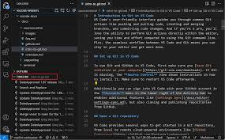

### Making Commits:

1. **Stage Changes:**
   - In the Source Control view, you'll see a list of changed files. Click the `+` button next to each file you want to stage for commit, or stage all changes by clicking the `+` button at the top (`Stage All Changes`).

   

2. **Commit Changes:**
   - Enter a commit message in the textbox labeled "Message (press Ctrl+Enter to commit)" at the top of the Source Control view.
   - Press `Ctrl + Enter` (Windows/Linux) or `Cmd + Enter` (macOS) to commit the staged changes.

   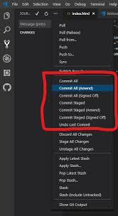

### Pushing Changes to GitHub:

1. **Linking to a Remote Repository (GitHub):**
   - If your project is not yet linked to a remote repository (like GitHub), you need to set this up first:
     - Go to GitHub and create a new repository.
     - Copy the HTTPS or SSH URL of your repository.
     - In VS Code, use the command palette (`Ctrl + Shift + P`) and type `Git: Add Remote` to add your remote repository.

2. **Pushing Changes:**
   - After committing your changes locally:
     - Click on the ellipsis (`...`) next to the commit message in the Source Control view.
     - Select `Push` from the dropdown menu to push your committed changes to the remote repository (GitHub).
     - Enter your GitHub credentials if prompted.

   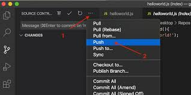

### Additional Tips:

- **Pulling Changes:** Use `Git: Pull` from the command palette to fetch and merge changes from the remote repository into your local branch.
- **Branching and Merging:** Use the Source Control view to manage branches (`Ctrl + Shift + P` and type `Git: Create Branch` or `Git: Checkout to` switch branches).
- **Git History:** View commit history and compare changes using the Source Control view.

By following these steps, users can effectively utilize Git for version control directly within VS Code, streamlining the development process and ensuring collaborative coding practices, especially when working with remote repositories like GitHub.
 Submission Guidelines:
- Your answers should be well-structured, concise, and to the point.
- Provide screenshots or step-by-step instructions where applicable.
- Cite any references or sources you use in your answers.
- Submit your completed assignment by 1st July 

